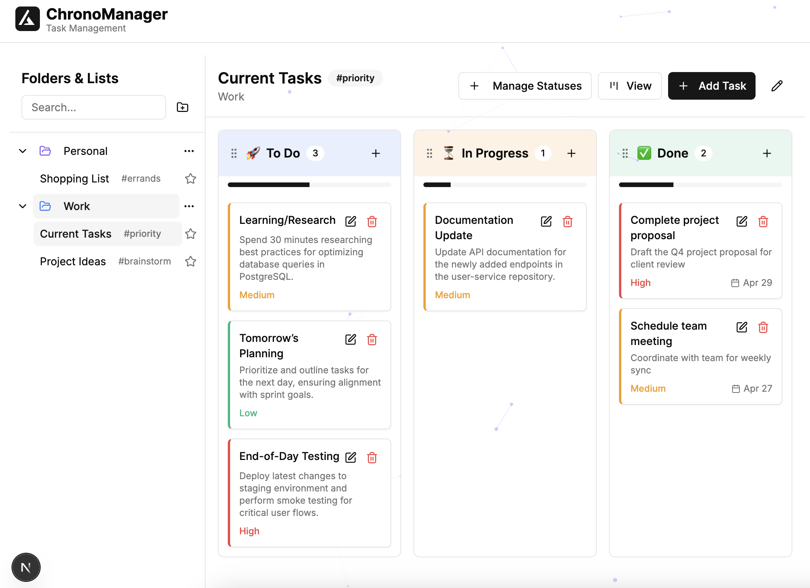

# ChronoManager

<div align="center">
  
  
  <p><em>An intuitive task management app featuring folders, lists, drag-and-drop, and three powerful views</em></p>
</div>

## 🚀 Overview

ChronoManager is a modern task management application built with Next.js and React that helps you organize your work and personal projects. With its intuitive interface and powerful features, ChronoManager makes it easy to keep track of your tasks and stay productive.

## ✨ Features

- **Multiple Organizational Views**:

  - 📊 **Kanban Board**: Visualize task flow and progress
  - ✅ **Checklist View**: Simple, focused task completion
  - 📈 **Priority Table**: Sort tasks by importance and urgency

- **Advanced Organization**:

  - 📁 Create folders to separate work, personal, and project tasks
  - 📝 Organize tasks into lists within folders
  - 🏷️ Add tags to categorize tasks further

- **Interactive UI**:

  - 🔄 Drag and drop tasks between statuses
  - 🎨 Customize statuses with colors and emojis
  - ✨ Beautiful animations and interactive elements
  - 🖼️ Interactive particle background

- **Data Persistence**:
  - 💾 All task data is saved to localStorage
  - 🔄 Automatic saving when changes are made

## 🛠️ Technology Stack

- [Next.js](https://nextjs.org/) - React framework
- [React](https://reactjs.org/) - UI library
- [Tailwind CSS](https://tailwindcss.com/) - Styling
- [tsparticles](https://particles.js.org/) - Animated background
- [UUID](https://github.com/uuidjs/uuid) - Unique IDs generation

## 🏁 Getting Started

### Prerequisites

- Node.js (v16 or higher)
- npm or yarn

### Installation

1. Clone the repository:

   ```bash
   git clone https://github.com/yourusername/chronomanager.git
   cd chronomanager
   ```

2. Install dependencies:

   ```bash
   pnpm install
   ```

3. Run the development server:

   ```bash
   pnpm run dev
   ```

4. Open [http://localhost:3000](http://localhost:3000) in your browser to see the application.

## 🧩 Project Structure

```
chronomanager/
├── app/                  # Next.js app directory
│   ├── layout.tsx        # Root layout with metadata
│   └── page.tsx          # Main entry point
├── components/           # React components
│   ├── app-header.tsx    # App header with logo
│   ├── animated-background.tsx # Particle animation
│   ├── folder-list-system.tsx  # Core task system
│   ├── enhanced-sidebar.tsx    # Sidebar navigation
│   ├── main-content.tsx        # Main content area
│   ├── task-manager.tsx        # Task manager component
│   ├── views/                  # Task view components
│   └── ui/                     # UI components
├── public/               # Static assets
└── types/                # TypeScript type definitions
```

## 🎮 Customization

### App Header and Styling

The app header uses a modern design with animated elements. You can customize it by modifying the `app-header.tsx` file:

```tsx
// components/app-header.tsx
<header
  className={cn(
    'sticky top-0 z-30 transition-all duration-300 backdrop-blur-sm',
    scrolled
      ? 'shadow-md bg-white/80 dark:bg-black/80'
      : 'bg-white/95 dark:bg-black/95',
    className
  )}
>
  {/* Header content */}
</header>
```

The gradient title can be customized by changing the gradient colors:

```tsx
<span className='text-xl font-bold leading-tight bg-clip-text text-transparent bg-gradient-to-r from-indigo-600 to-purple-600'>
  ChronoManager
</span>
```

### Animated Background

The animated background uses tsParticles to create an interactive particle effect. You can customize the background by modifying the `animated-background.tsx` file:

```tsx
// components/animated-background.tsx
export default function AnimatedBackground() {
  // ...
  return (
    <div className='fixed inset-0 -z-10'>
      <Particles
        options={{
          // Customize particles here
          particles: {
            color: {
              value: '#6366f1', // Change color
            },
            number: {
              value: 30, // Change density
            },
            // More options...
          },
        }}
      />
    </div>
  );
}
```

Common customizations:

- Change particle colors: Set `particles.color.value` to a color string or array of colors
- Adjust particle count: Modify `particles.number.value`
- Change particle size: Adjust `particles.size.value`
- Modify animation speed: Set `particles.move.speed`

### Theme Colors

The app uses Tailwind CSS for styling. You can customize the color scheme by modifying the `globals.css` file:

```css
@layer base {
  :root {
    --background: 0 0% 100%;
    --foreground: 0 0% 3.9%;
    /* More variables... */
    --primary: 0 0% 9%;
    --primary-foreground: 0 0% 98%;
    /* Customize colors here */
  }
}
```

## 🎨 Screenshots

<div align="center">
  
  </br>
  </br>
  </br>
  
  </br>
  </br>
  </br>
  

</div>

## 🚧 Future Improvements

- [ ] User authentication and cloud syncing
- [ ] Dark/light theme toggle
- [ ] Mobile app with offline capabilities
- [ ] Calendar integration
- [ ] Recurring tasks
- [ ] Notifications and reminders
- [ ] Team collaboration features

## 📝 License

[MIT](LICENSE)

## 👤 Author

- [Abdelkader Bouzomita](https://www.linkedin.com/in/bouzomita-abdelkader-928953234/)

---

<div align="center">
  <p>Made with ❤️ for better productivity</p>
</div>
